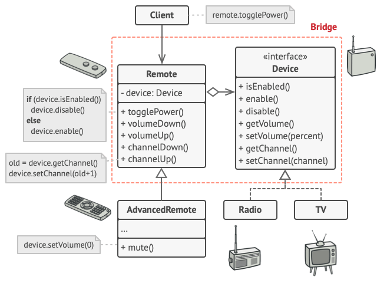

# Bridge Design Pattern

## Definition

Bridge is a structural design pattern that lets you split a large class or a set of closely related classes into two separate hierarchies—abstraction and implementation—which can be developed independently of each other.

## Example
### Division of device and remote controller

In our example we divide monolith code into abstraction (remotes) and implementation (Devices).
Thanks to this Remote is Device type independent and more open for modifications and new implementations.
Moreover, there is a proposal for more advanced remote with more functions that extends BasicRemote

## Other

- Example is from awesome website [Refactoring Guru](https://refactoring.guru)